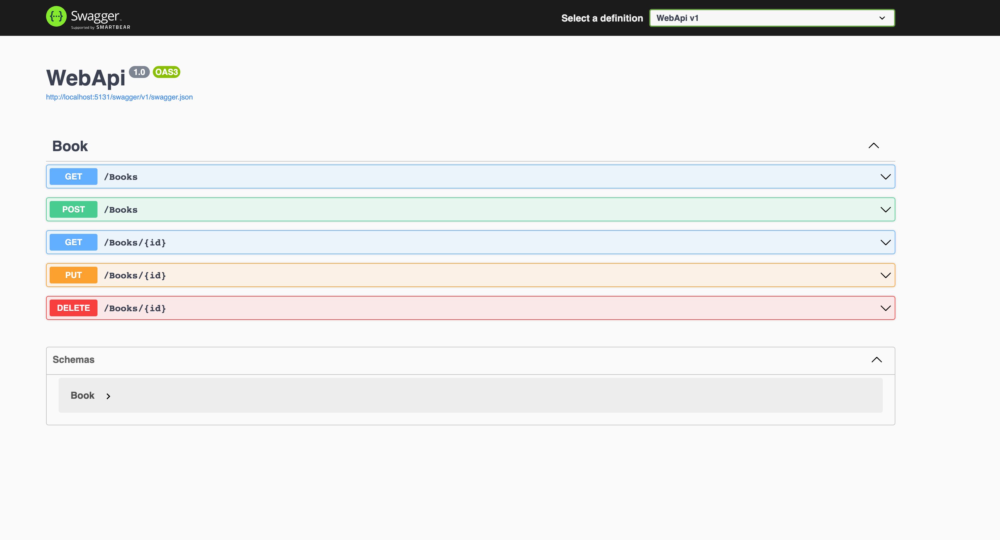

# BookStore-WebApi-.NETCore

### Proje Oluşturma Adımları

1. dotnet new webapi -n WebApi // WebApi projesi oluşturma
2. dotnet new sln -n BookStoreSln // BookStoreSln çözümü oluşturma
3. dotnet sln add WebApi // WebApi projesini BookStoreSln çözümüne ekleme
4. launch.json oluştur. (Visual Studio Code için)
5. Swagger için dotnet watch run // WebApi projesini çalıştırma
